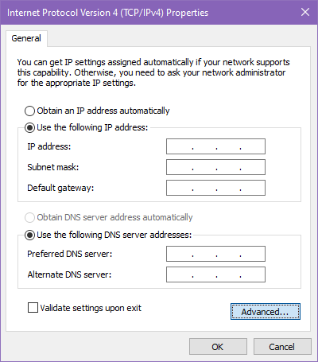
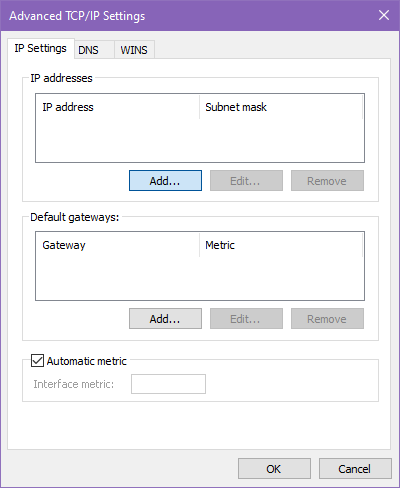
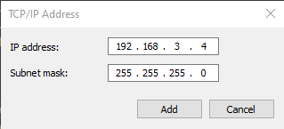

# PC Network Setup

**!! This guide is only meant for setting up the connection of the PC at inno.space. You should not use your personal device to connect to the lasercutter!!**

## Setup

The [official Epilog installation guide](https://www.epiloglaser.com/assets/downloads/manuals/legend-manual-web.pdf) applies for the most part, this guide will only explain the steps which differ for our setup.

*Since Windows 10 is slowly moving all settings to the modern UI, please update the provided steps if they become inaccessible in the future.*

1. Before you begin, note down the PC's assigned IP address, gateway address and subnet mask since we will need to disable DHCP. The IP address can be found using `ipconfig` the command in the Command Line Prompt or through the network's properties button in the network settings menu.  
2. Set up the lasercutter itself as instructed. (Default IP Address of `192.168.003.004`).  
3. Go to the *Windows 8 and 10: Ethernet Installation* section.  
4. Follow the guide to Step 4 where the IPv4 settings window is opened.  
5. Set the IP Address settings to the configuration you noted down previously, instead of the information provided by the guide.  

    Next open the advance IPv4 settings.  
    

    Next add a new IP address entry.  
    

    In the Add dialog enter the IP address specified in the guide, `192.168.3.3` and the network mask `255.255.255.0`. Make sure the network mask matches the setting in the lasercutter and that the IP address are *not* the same.  

    

6. Now you should be able to get a response from the lasercutter using `ping 192.168.3.4` in Command Line Prompt. If so you can move forward to the *Installing the Driver* section of the official guide to complete the setup.

## Troubleshooting

* If you cannot get a response from the lasercutter when pinging its address, you can instead set the PC's IP address directly to the one needed to connected to the lasercutter i.e. 192.168.3.4. Additionally try connecting the Ethernet cable directly to the cutter without a switch. Either of these options will disconnect the PC from the internet, so they can only be used to confirm the lasercutter settings.  
