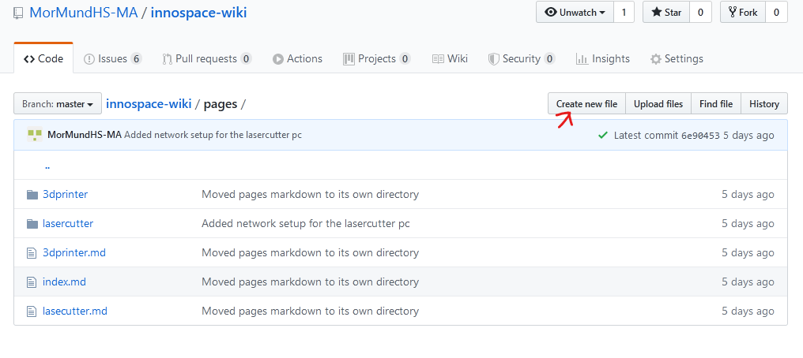
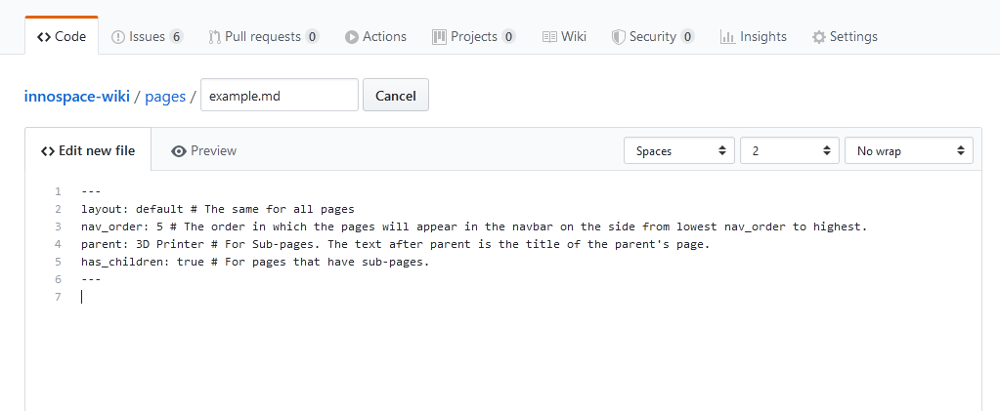

# Creating a new page

A new page can be added by creating a new `.md` file in the `pages` folder or one of its subdirectories.



This opens the same editor described in [Updating a page](./updatePage). But before you begin writing your page you will have to add a few necessary pieces of information.



1. Setting a filename. The name does not affect anything on the final page, but it should be recognizable by others interested in editing the wiki and it *has* to end in `.md`.  
2. Adding the meta information. You can copy the text below as a starting point and fill out the information as described in the comments (the text behind the `#` symbols).

    ``` markdown
    ---
    layout: default # The same for all pages
    nav_order: 5 # The order in which the pages will appear in the navbar on the side from lowest nav_order to highest.
    parent: 3D Printer # For Sub-pages. The text after parent is the title of the parent's page.
    has_children: true # For pages that have sub-pages.
    ---
    ```

3. Now you can add the content of the page and submit it as described in [Updating a page, Submitting changes](updatePage#3-submitting-changes)
