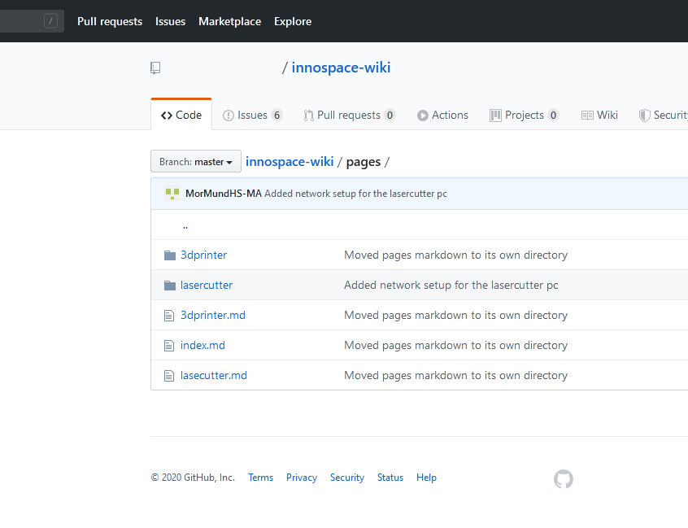
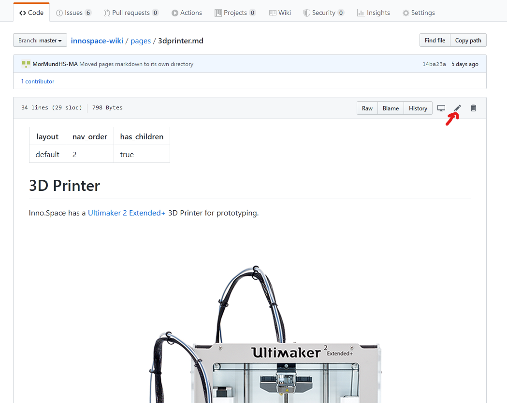
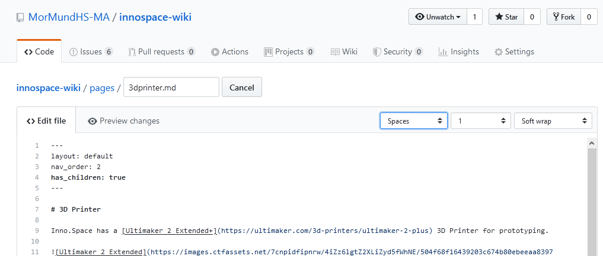
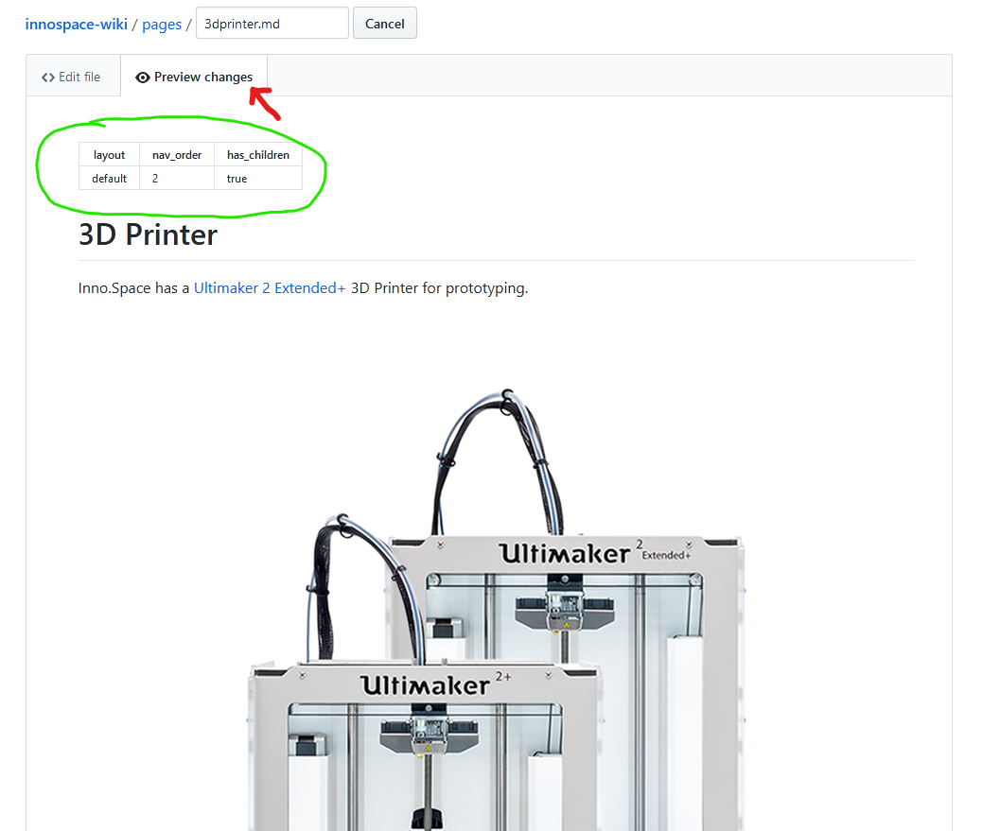

# Updating a page

## 1. Finding the page

To update an existing page we first need to find the file representing it. At [repo link] you can view these files in an online explorer. The filenames should be roughly the page's title, sometimes shortened, followed by the `.md` extension. Sub-pages can be found in a folder named like the top-level page. For example the checklist for 3D-Printing can be found in `3dprinter/checklist.md`

## 2. Editing the page

All pages are written in Markdown. Markdown files are simple text files which allow layout and styling through a few special characters. For example text can be written in *italic* by adding stars `*` around it like this `*italic*`. You can find a complete guide of the available Syntax [here](https://guides.github.com/features/mastering-markdown/). To start editing a file on GitHub click the pen icon in the top right.

You can now edit the text and preview the changes with the preview changes tab.

Please note that this preview is not 100% accurate to how exactly the page will look in the wiki itself. However the layout, headings and images will appear similarly in the wiki.
Also, please ignore the table at the top of the page (marked in green). It contains metadata for the wiki's content layout.

## 3. Submitting changes

[TODO]
